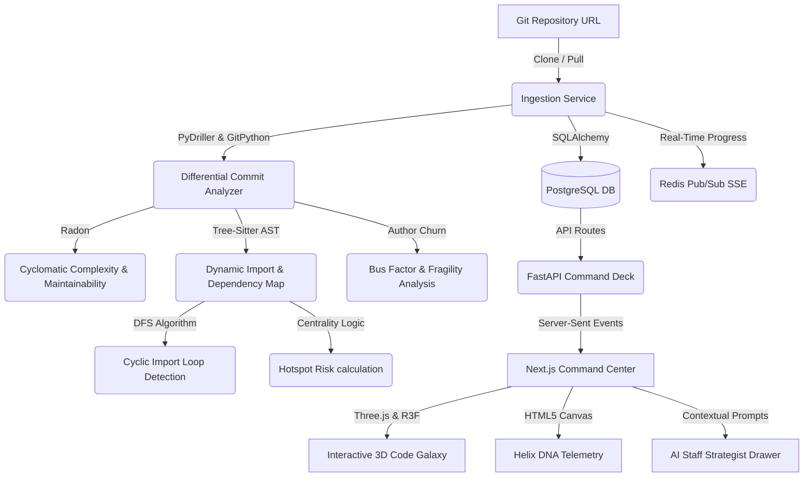

# 🪐 AetherGraph — Temporal Intelligence Engine

> A production-grade, cinematic AI-powered observatory designed to visualize repository evolution, detect architectural drift, and preempt engineering risks.

AetherGraph parses codebases deep down to the AST level, maps the multi-dimensional relationships between modules, and tracks engineering metrics over time. By combining traditional static analysis (Radon, Tree-sitter, GitPython, NetworkX) with advanced 3D WebGL visualizations and LLM reasoning, AetherGraph offers Staff Engineers and CTOs a comprehensive view of codebase health *before* issues occur.

---

## 📸 Immersive Cinematic UI

AetherGraph features a futuristic, glassmorphic UI loaded with micro-animations, real-time Canvas drawings, and fully interactive 3D WebGL scenes.



---

## 🌟 Core Features & Added Capabilities

### 1. 🌌 Interactive 3D Code Galaxy & Knowledge Graph
*   **WebGL Visualization**: Built using **Three.js** and **React Three Fiber (R3F)**, rendering thousands of file nodes clustered in spiral galaxy formations.
*   **Dynamic Colors & Scales**: Automatically scales node size based on file complexity and changes color (Healthy Cyan $\rightarrow$ Degraded Orange $\rightarrow$ Severe Red) dynamically depending on volatility.
*   **Butterfly Tracer (Ripple Effect)**: Select any module to trace outward propagation paths and dependency relationships, letting you see exactly how a single change ripples across the codebase.
*   **Orbit Controls**: Fully rotate, zoom, and pan around the 3D graph cluster with dynamic auto-rotation.

### 2. 🧬 Helix DNA Telemetry Engine
*   **Canvas Drawing**: Custom HTML5 high-performance rendering Canvas visualizer representing the repository's systemic footprint.
*   **Real-time Mutation Waveforms**: Uses sine-wave base-pair animations where the frequency, amplitude, and jitter are dictated by code health.
*   **Volatility Jitter**: Lower stability factors inject chaotic physical jitter and color shifts (Cyan $\rightarrow$ Orange/Red) to signify high codebase mutation rates.

### 3. 🌲 Multi-Language AST Parser
*   **Tree-sitter Parsing**: Advanced abstract syntax tree parsing for **Python**, **JavaScript**, and **TypeScript** code.
*   **Resilient Fallbacks**: Integrated regex engines to dynamically extract imports from **Go**, **Java**, **C++**, and **Rust** files in case AST queries fail, ensuring seamless support across all major programming ecosystems.

### 4. 🔄 DFS Cyclic Loop Detection
*   **Circular Import Audits**: Implements Depth-First Search (DFS) topological sorting to locate circular dependency pathways.
*   **Drift Analysis**: Flags coupling loops instantly on the Command Deck so developers can decouple layers before code boundaries erode.

### 5. 🔥 Multi-Dimensional Hotspots Engine
*   **Risk Metric Indexing**: Ranks files using a tailored mathematical risk formula:
    $$\text{Hotspot Score} = \text{Complexity} \times \text{Churn} \times \text{Centrality} \times \text{Volatility} \times \text{Recency}$$
*   **centrality**: Measures the number of incoming and outgoing dependency connections.
*   **volatility**: Captures commit-by-commit structural volatility to flag high-risk hotspots.

### 6. 👥 Bus Factor & Fragility Ledger
*   **Maintainer Criticality Index**: Audits commit distributions per developer and flags high concentration metrics.
*   **Fragility Forecast**: Calculates the mathematical minimum number of authors who own $>50\%$ of the codebase, presenting a clear, simulated risk index should key developers leave.

### 7. 🔮 Pre-Merge PR Impact Simulator
*   **Technical Debt Sandbox**: Allows developers to input hypothetical Pull Request specifications (Changed Files, Insertions, Deletions, Affected Modules).
*   **AI Staff Narrator**: Leverages an offline-fallback-enabled **GPT-4o-mini** model to generate concise, technical explanations of pre-merge architectural risk.

### 8. 🤖 AI Staff Strategist Chat Drawer
*   **Context-Based presets**: Automatically synchronizes query presets depending on the active Command Deck tab (Overview, Evolution, Architecture, Hotspots, Bus Factor, Forecasts).
*   **Interactive Diagnostics**: Converses dynamically with users to offer step-by-step circular import decoupling strategies, hotspot mitigation plans, and refactoring guidelines.

---

## 🛠️ Technology Stack

### Frontend Command Center
*   **Framework**: Next.js 16 (App Router), React 19, TypeScript
*   **3D graphics**: Three.js, React Three Fiber (`@react-three/fiber`, `@react-three/drei`), D3.js
*   **Animations**: Framer Motion
*   **Iconography**: Lucide React
*   **Styling**: Tailwind CSS v4 (with PostCSS compilation)
*   **State Management**: Zustand
*   **Client**: Axios

### Backend Command Deck
*   **API Framework**: FastAPI, Uvicorn (Asynchronous Python ASGI)
*   **Database & ORM**: PostgreSQL, SQLAlchemy, Alembic Migrations
*   **Data Models**: Pydantic v2
*   **Real-time Streaming**: Server-Sent Events (SSE) with Redis Pub/Sub progress tracking
*   **Code Analysis**: radon (Cyclomatic Complexity & Maintainability Index), tree-sitter AST, GitPython, PyDriller
*   **Caching & Broker**: Redis 7
*   **AI Engine**: OpenAI API (`gpt-4o-mini` with zero-network mock fallbacks for offline demoing)

---

## 🚀 Getting Started

Follow these steps to deploy AetherGraph on your local workstation.

### Prerequisites
*   [Node.js](https://nodejs.org/) (v18.x or newer)
*   [Python](https://www.python.org/) (v3.10 or newer)
*   [Docker Desktop](https://www.docker.com/) (For PostgreSQL and Redis)

---

### Step 1: Initialize Database & Cache Services
Run the pre-configured Docker Compose file to start PostgreSQL and Redis in the background:
```bash
docker-compose up -d
```

---

### Step 2: Configure & Launch the Backend

1.  Navigate to the backend directory:
    ```bash
    cd backend
    ```
2.  Create a virtual environment and activate it:
    ```bash
    # Windows PowerShell
    python -m venv venv
    .\venv\Scripts\Activate.ps1
    
    # macOS/Linux
    python3 -m venv venv
    source venv/bin/activate
    ```
3.  Install the required dependencies:
    ```bash
    pip install -r requirements.txt
    ```
4.  Launch the FastAPI server:
    ```bash
    uvicorn app.main:app --reload
    ```
    *The API will start running at:* `http://127.0.0.1:8000`

---

### Step 3: Configure & Launch the Frontend

1.  Navigate to the frontend directory:
    ```bash
    cd ../frontend
    ```
2.  Install packages:
    ```bash
    npm install
    ```
3.  Launch the Next.js development server:
    ```bash
    npm run dev
    ```
    *The visual observatory will start running at:* `http://localhost:3000`

---

## 🧪 Engineering Command Logs (Dev Mode)

Toggle **Dev Mode** in the top-right header of the application to view administrative telemetry:
*   **Worker Threads**: Live monitoring of repository background processes.
*   **LLM Token Tracking**: Real-time counter of total cached GPT-4o-mini request and response tokens stored in Redis.
*   **SSE Log Pipes**: Raw Server-Sent Events stream visualization of ingestion tasks.

---

## 🛡️ License

Built with extreme passion for premium UX and software architecture. Licensed under the MIT License.
